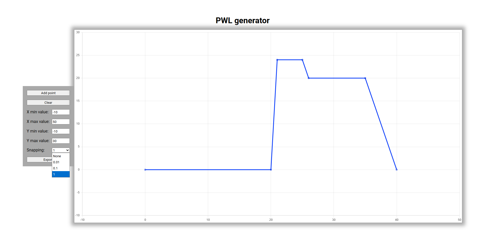
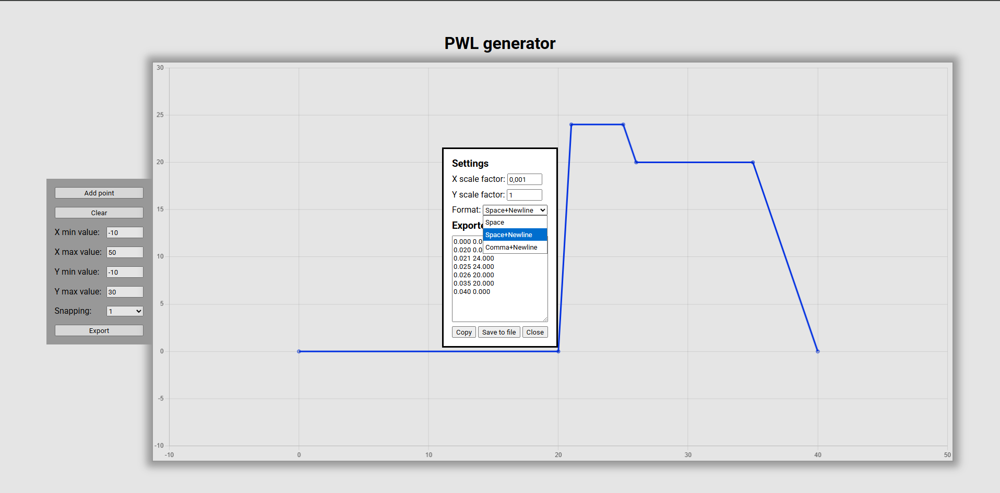

# PWL editor

Simple GUI for creating and modyfying LtSpice PWL files or sequences.

To import existing data paste it on the website.

Exporting can be done with scaling set for each axis and in various formats.

